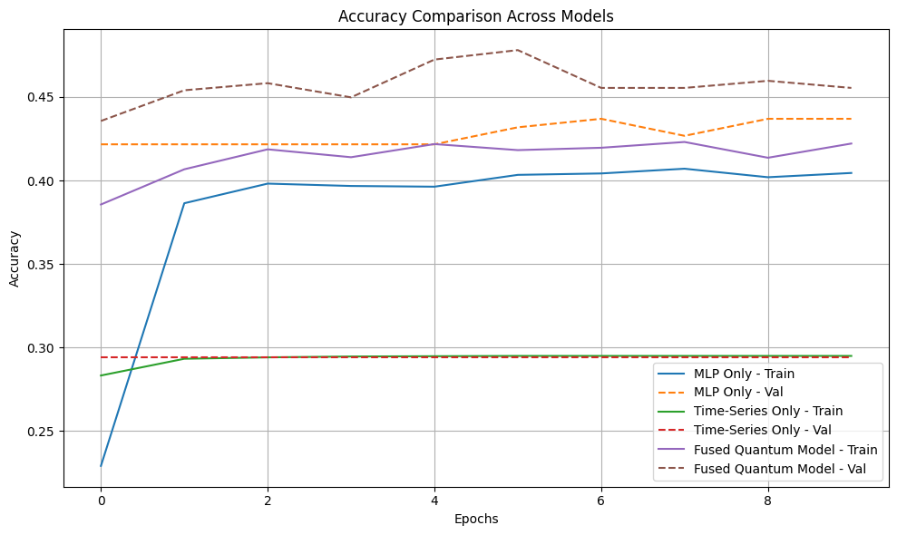
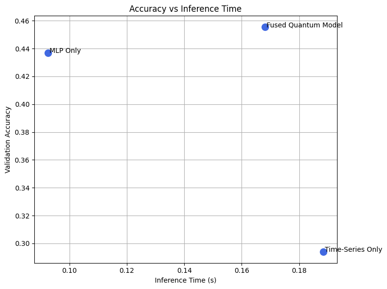

# Quantum Astronomical Fusion  

**Author:** Dharun Ramesh  
**License:** [Creative Commons Attribution 4.0 International (CC BY 4.0)](https://creativecommons.org/licenses/by/4.0/)  

This repository contains the full implementation of our **Quantum-Enhanced Fusion Model**, which combines classical MLP and LSTM-based time series models with quantum circuit fusion layers. The model is applied to the **PLAsTiCC Astronomical Classification dataset** for celestial object classification.

> ⚠️ **Authorship & License Protection**  
> This work is **developed and maintained entirely by Dharun Ramesh** and is protected under the Creative Commons License (CC-BY 4.0).  
> Any reuse or publication **must provide proper attribution**. Unauthorized removal of authorship is a violation of the license terms.

---

## 🚀 Features  
✔️ **Hybrid Model Fusion**: MLP for metadata + LSTM for time-series + Quantum circuits for feature enhancement  
✔️ **Benchmarking Against Baselines**: Compared against classical MLP and LSTM-only models  
✔️ **Astronomical Dataset Application**: Uses PLAsTiCC dataset to classify celestial objects  
✔️ **Fully Open Source & Reproducible**  

---

## 📊 Results & Ablation Study  

### Accuracy Comparison  
  

### Inference Time vs. Accuracy  
  
> 📌 **Key Takeaway**: The fused model achieves superior accuracy with a minimal inference-time tradeoff.

---

## 📌 Citation  

If you use this work, **please cite it as follows**:  

```bibtex
@software{ramesh2025quantumfusion,
  author = {Dharun Ramesh},
  title = {Quantum Astronomical Fusion},
  year = {2025},
  version = {1.0.0},
  url = {https://github.com/dr1810/Quantum_Astronomical_Fusion},
  license = {CC-BY-4.0}
}
